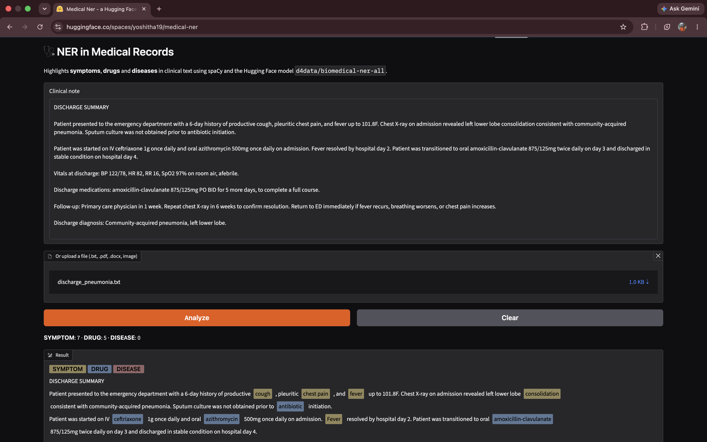

# 🩺 NER in Medical Records

Finds and highlights **symptoms**, **drugs** and **diseases** in clinical notes, prescriptions and discharge summaries.

**Live demo:** https://huggingface.co/spaces/yoshitha19/medical-ner



## Features

- Highlights entities in colour: 🟨 symptoms · 🟦 drugs · 🟥 diseases
- Type or paste text, or upload a file: `.txt`, `.pdf`, `.docx`, `.png`, `.jpg`
- Reads scanned PDFs and photos of documents with OCR
- Detects **negation**: "denies fever", "no history of diabetes", "malaria ruled out" are **not highlighted**
- Medical dictionary of ~350 terms, including common Indian drug brands (Dolo 650, Pan 40, Glycomet, Telma…)
- Counts each entity type

## How it works

```
text / file ──► OCR (if scanned) ──► spaCy EntityRuler ──► Hugging Face model ──► negspacy ──► highlighted result
                   Tesseract          medical dictionary     fills in the rest     negation
```

1. **spaCy EntityRuler** matches known medical terms from a dictionary. This is fast and precise.
2. **Hugging Face transformer** [`d4data/biomedical-ner-all`](https://huggingface.co/d4data/biomedical-ner-all), a DistilBERT model trained on clinical case reports, finds entities the dictionary doesn't know, such as *burning micturition* or *Montair LC*. Its labels are mapped to SYMPTOM, DRUG and DISEASE, and predictions below 0.5 confidence are dropped.
3. Overlapping matches are merged, keeping the longest span.
4. **negspacy** (NegEx algorithm, clinical term set) checks each entity's sentence for negation cues like *denies*, *no history of*, *negative for* and *ruled out*, and leaves negated entities unhighlighted.

## Accuracy

`WApp/backend/evaluate.py` scores the model on 20 annotated clinical notes (`test_notes.txt`) and reports precision, recall and F1 per entity type, plus a list of every mistake:

```bash
cd WApp/backend
python evaluate.py              # dictionary + Hugging Face model
USE_HF=0 python evaluate.py     # dictionary only, to compare
```

| Setup | Symptom F1 | Drug F1 | Disease F1 | Overall F1 (exact) | Overall F1 (overlap) |
|---|---|---|---|---|---|
| Dictionary only | 94% | 97% | 95% | 95% | 96% |
| Dictionary + Hugging Face | 95% | 92% | 95% | 94% | **98%** |

The test notes were written for this project, so these scores are optimistic. A public annotated dataset would give a more reliable number.

## Tech stack

Python · spaCy · negspacy · Hugging Face Transformers · PyTorch · Tesseract OCR · PyMuPDF · Flask · React (Vite) · Gradio · Hugging Face Spaces (ZeroGPU)

## Project structure

```
├── space/              Gradio app deployed on Hugging Face Spaces (live demo)
└── WApp/
    ├── backend/        Flask API: /ner (text) and /upload (files), evaluate.py, test_notes.txt
    └── frontend/       React web app
```

## Run locally

**Backend**

```bash
python -m venv venv
source venv/bin/activate
cd WApp/backend
pip install -r requirements.txt
brew install tesseract          # for OCR (Mac); Ubuntu: sudo apt install tesseract-ocr
python app.py                   # http://localhost:5001
```

**Frontend** (in a second terminal)

```bash
cd WApp/frontend
npm install
npm run dev                     # http://localhost:5173
```

**Or the Gradio version**

```bash
cd space
pip install -r requirements.txt gradio
python app.py                   # http://localhost:7860
```

The Hugging Face model (~260 MB) downloads on the first run.

## Limitations and next steps

- **Negation scope:** negation is checked within a sentence, so "malaria ruled out, fever persists" also marks *fever* as negated.
- **Dictionary coverage:** terms outside the dictionary (e.g. *photophobia*, *Pregabalin*) depend on the transformer.
- **OCR** works well on printed text but not on handwriting.
- Not a medical device. This is for demonstration only.